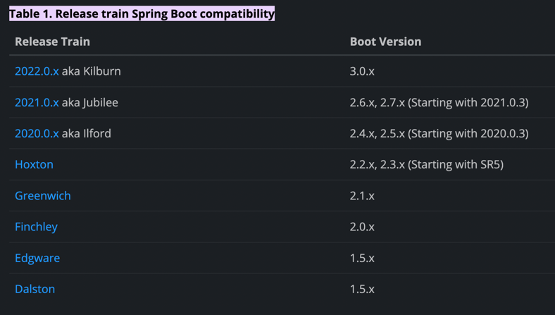
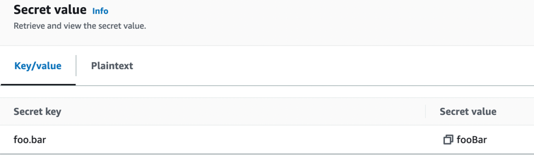

# Spring Cloud Context    


## Summary    

- Spring Cloud Application은 ```bootstrap``` context를 사용한다.        
- ```bootstrap``` context는 main application context의 ```parent``` 이다.    
- external source로부터 property를 load 하는 책임을 가진다.
- ```bootstrap``` context와 ```main``` context는 ```Environment```를 공유한다.
- default로 ```bootstrap.yml```을 참조한다.       

## Use case (aws-secrets manager)        

- db connection 정보 등 형상관리 되면 안되는 property들이 존재한다.    
- CI/CD 파이프라인을 통한 주입, kube secret 을 통한 주입 등의 방법이 있다.    
- bootstrap context와 aws secrets manager를 통해서 주입하는 방법에 대해 알아본다.      

### bootstrap 로드 여부 확인        

```yaml
# bootstrap.yml    
external:
  foo: 'external-foo' # 테스트를 위한 props
# application.yml
internal:
  foo: 'internal-foo'
```   

```java
@Slf4j
@SpringBootApplication
public class Main {
    @Value("${internal.foo:undefined}")
    private String internalFoo;
    @Value("${external.foo:undefined}")
    private String externalFoo;

    public static void main(String[] args) {
        SpringApplication.run(Main.class, args);
    }

    @PostConstruct
    public void inspect() {
        log.debug("internal : {}", internalFoo);    // internal-foo
        log.debug("external : {}", externalFoo);    // undefined
    }
}
```

> bootstrap.yml를 로드하지 않는다.    

- 종속성 추가
[version compatibility](https://spring.io/projects/spring-cloud#:~:text=Table%201.%20Release%20train%20Spring%20Boot%20compatibility)    
 


```
    implementation("org.springframework.cloud:spring-cloud-starter-bootstrap:3.1.5")
```

- 재확인    
```java
@PostConstruct
public void inspect() {
    log.debug("internal : {}", internalFoo);    // internal-foo
    log.debug("external : {}", externalFoo);    // external-foo
}
```

### aws secret manager 연동하기

- 사전에 aws secrets manager에 다음과 같이 미리 등록해놓았다.    

     

- 다음과 같이 작성한다.
```yaml
# bootstrap.yml
external:
  foo: 'external-foo' # 테스트를 위한 props
cloud:
  aws:
    region:
      static: ap-northeast-2  // region 명시
aws:
  secretsmanager:
    prefix: "/secret"       
    name: "foo"

# application.yml
fooFromAws: ${foo.bar}   // secret manager 가 application.yml 에 주입되는지 확인
```

```java
@Slf4j
@SpringBootApplication
public class Main {
    @Value("${internal.foo:undefined}")
    private String internalFoo;
    @Value("${external.foo:undefined}")
    private String externalFoo;

    @Value("${foo.bar:undefined}")
    private String awsProps;

    @Value("${fooFromAws:undefined}")
    private String fooFromAws;

    public static void main(String[] args) {
        SpringApplication.run(Main.class, args);
    }
    
    @PostConstruct
    public void inspect() {
        log.debug("internal : {}", internalFoo);        // internal-foo
        log.debug("external : {}", externalFoo);        // external-foo
        log.debug("awsProps : {}", awsProps);           // fooBar
        log.debug("fooFromAws : {}", fooFromAws);       // fooBar
    }
}
```


